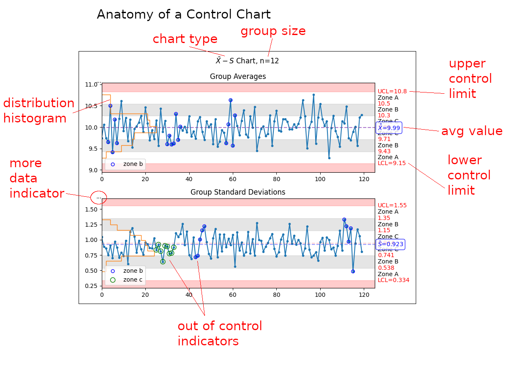

Plotting
========

The most useful features of ``manufacturing`` come in the form of the highly
information-dense plotting tools.

Ppk Plot
---------

The :meth:`manufacturing.ppk_plot` takes all of the data - not just a sample - and determines the process
capability.  This is not a snapshot in time but a look at the entire history.  Careful,
which this can be can be deceiving!

The :meth:``manufacturing.ppk_plot`` will estimate the distribution based on the input
data, calculate the Ppk, mean, standard deviation, and the estimated % out of control
for each parameter.  The function will also generate a warning if the data appears
to be non-normally distributed.

.. code-block:: python

    import manufacturing as mn

    # the 'data' variable contains a list of integers, floats,
    # numpy array, or pandas Series
    mn.ppk_plot(data, upper_specification_limit=3.3, lower_specification_limit=3.1)

.. image:: _static/images/ppk_plot.png

If ``manufacturing`` is used in a jupyter notebook or similar environment, then
the plot will display automatically.  Optionally, you can pass a ``matplotlib.figure.Figure``
instance in order to more directly manipulate the underlying ``matplotlib.figure.Figure``.

.. code-block:: python

    import manufacturing as mn
    import matplotlib.pyplot as plt

    fig, ax = plt.subplots()
    mn.ppk_plot(data,
                upper_specification_limit=3.3,
                lower_specification_limit=3.1,
                figure=fig)

    ax.set_xlim(3.0, 3.5)  # manipulate the axis as desired

Cpk Chart
---------

The :meth:`manufacturing.cpk_plot` gives snapshots of process capability.  In most cases, the average
Cpk value should be close to the overall Ppk value.  If not, then the process may
not be in control.

.. code-block:: python

    import manufacturing as mn

    # the 'data' variable contains a list of integers, floats,
    # numpy array, or pandas Series
    mn.cpk_plot(data,
                upper_specification_limit=7.4,
                lower_specification_limit=-7.4,
                subgroup_size=10)

.. image:: _static/images/cpk_plot.png

Zone Control Chart
------------------

Perhaps the most useful chart is the :meth:`manufacturing.control_plot`, also known as a
Zone Control Plot.  This plot will highlight up to 8 different rules or violations
based on the input data set.  If a control chart rule is not violated, then it will
not be placed on the chart.

There are three different types of control charts defined within ``manufacturing``:

 * :meth:`manufacturing.x_mr_chart()` for small data sets
 * :meth:`manufacturing.xbar_r_chart()` for subgroups between 2 and 10, inclusive
 * :meth:`manufacturing.xbar_s_chart()` for subgroups larger than 11, inclusive

Using the :meth:`manufacturing.control_plot` function will automatically select the appropriate
control chart type based on the number of data points supplied.

.. list-table:: Control Chart Rules by Severity
   :header-rows: 1

  * - Violation
    - Pattern
  * - beyond limits
    - Point is beyond the limits
  * - zone a
    - 2 out of 3 consecutive points in zone a or beyond
  * - zone b
    - 4 out of 5 consecutive points in zone b or beyond
  * - zone c
    - 7 or more consecutive points on one side of the average (in zone c or beyond)
  * - trend
    - 7 consecutive points trending up or trending down
  * - mixture
    - 8 consecutive points with no points in zone c
  * - stratification
    - 15 consecutive points in zone c
  * - over-control
    - 14 consecutive points alternating up and down

.. code-block:: python

    import manufacturing as mn

    # the 'data' variable contains a list of integers, floats,
    # numpy array, or pandas Series
    mn.control_plot(data)

Depending on the data set, the above command could result in the creation of an
:math:`X-mR` chart, :math:`\bar{X}-R` chart, or :math:`\bar{X}-S` chart.

.. image:: _static/images/xmr_chart.png

.. image:: _static/images/xbarr_chart.png

.. image:: _static/images/xbars_chart.png

Anatomy of a  Control Chart
---------------------------

A control chart is an information-dense representation of data coming
off of testers.  The ``manufacturing`` control chart has several sections
that warrant further explanation:

 * chart type - the chart type, usually based on recommended groupings
 * group size - when present, indicates how many samples were grouped to present each datapoint
 * distribution histogram - the statistical distribution of the data
 * more data indicator - when present, indicates that data was truncated before display in order to to not present so much information that the plot becomes unreadable
 * out of control indicators - when present, indicate that the process is out of control or nearly so
 * upper control limit - the upper control limit as calculated from the data on the plot
 * avg value - the average value as calculated from the data on the plot
 * lower control limit - the lower control limit as calculated from the data on the plot

Additional Chart Types
----------------------

p-Chart
#######

One may utilize the :meth:`manufacturing.p_chart()`, which requires a `pandas.DataFrame` rather than a `pandas.Series`.

.. image:: _static/images/p_chart.png

np-Chart
########

:meth:`manufacturing.np_chart()`

.. image:: _static/images/np_chart.png
