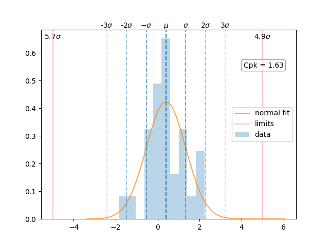
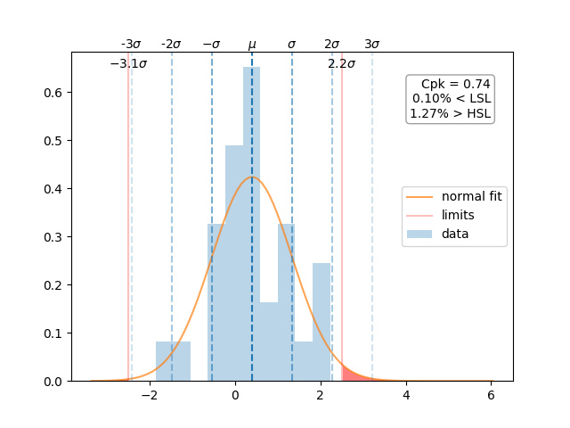

# Purpose

To provide analysis tools and metrics useful in manufacturing environments.

# Installation

## From `setup.py`

Clone this repository and install into your python environment using `setuptools`:

    $ git clone https://github.com/slightlynybbled/manufacturing
    $ cd manufacturing
    $ python setup.py install
    
## From Wheel File

Download the wheel file and install from pip:

    ~/downloads $ python -m pip install manufacturing-X.X.X-py3-none-any.whl
    
Of course, the `X.X.X` will be replaced with the version that you are looking at.

# Usage

## Visualizations with Jupyter Notebooks

Visualizations will return a `matplotlib.Figure`; therefore, if you want to embed 
an image into a jupyter notebook, you will need to use a semicolon at the end of
the function call in order to not have a double-image.

    data = np.random.normal(0, 1, size=30)  # generate some data
    manufacturing.show_cpk(data, lower_spec_limit=-2, upper_spec_limit=2);  # show the plot
    
Note the trailing semicolon on the second statement!

## Cpk Visualization

The most useful feature of the `manufacturing` package is the visualization of Cpk.
As hinted previously, the `show_cpk()` function is the primary method for display of
Cpk visual information.  First, get your data into a `list`, `numpy.array`, or 
`pandas.Series`; then supply that data, along with the `lower_spec_limit` and 
`upper_spec_limit` into the `show_cpk()` function.

    manufacturing.show_cpk(data, lower_spec_limit=-2, upper_spec_limit=2)
    

In this example, it appears that the manufacturing processes are not up to the task of 
making consistent product within the specified limits.

# Features

 * Cp and ~~Cpk~~ analysis
 * Cp and ~~Cpk~~ plots/histograms
 * Pp and Ppk analysis
 * Pp and Ppk plots/histograms
 * Trend analysis
 * In-control/out-of-control analysis
 * Gage R&R package
 * Import from CSV
 * Import from MS Excel

# Gallery

# 

# 
