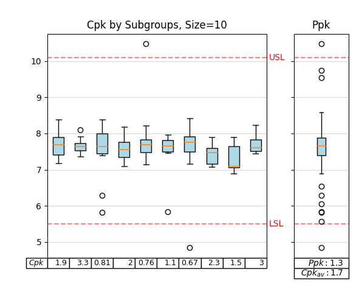
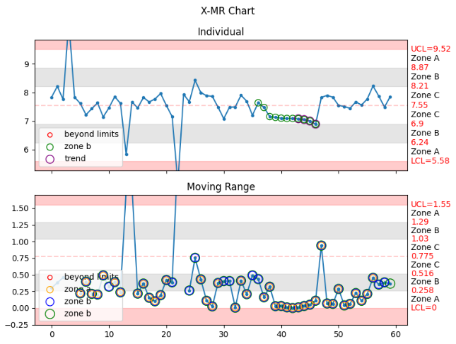
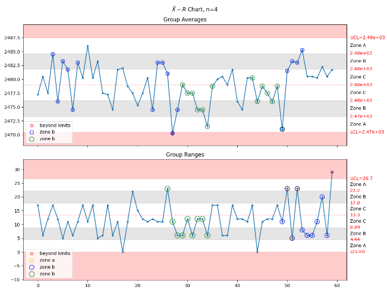
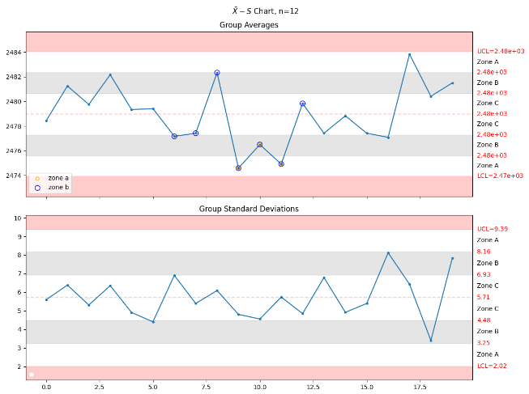

# Purpose

To provide analysis tools and metrics useful in manufacturing environments.

I am slowly generating the documentation and, as that is maturing, I will begin to move information
from this `readme.md` into that location.  If you don't find something here, head over to the
[documentation](https://manufacturing.readthedocs.io/en/latest/).

# Project Maturity

Every effort is being made to ensure that the results are accurate, but the user is ultimately
responsible for any resulting analysis.

The API should not be considered stable until v1.0 or greater.  Until then, breaking changes may
be released as different API options are explored.

During the `v0.X.X` versioning, I am using the package in my own analyses in order to find any bugs.  Once
I am reasonably satisfied that the package is feature complete, usable, and bug-free, I will break out
the `v1.X.X` releases.

# Installation

To install from `pypi`:

    pip install manufacturing

To install from source download and install using poetry:

    poetry install

# Usage

## Visualizations with Jupyter Notebooks

Visualizations work approximately as expected within a jupyter notebook.

    data = np.random.normal(0, 1, size=30)  # generate some data
    manufacturing.ppk_plot(data, lower_specification_limit=-2, upper_specification_limit=2)
    
There is a sample jupyter notebook in the examples directory.

## Cpk Visualization

The most useful feature of the `manufacturing` package is the visualization of Cpk.
As hinted previously, the `ppk_plot()` function is the primary method for display of
Cpk visual information.  First, get your data into a `list`, `numpy.array`, or 
`pandas.Series`; then supply that data, along with the `lower_control_limit` and 
`upper_control_limit` into the `ppk_plot()` function.

    manufacturing.ppk_plot(data, lower_specification_limit=-2, upper_specification_limit=2)
    

In this example, it appears that the manufacturing processes are not up to the task of 
making consistent product within the specified limits.

## Zone Control Visualization

Another useful feature is the zone control visualization.

    manufacturing.control_chart(data)

There are X-MR charts, Xbar-R charts, and Xbar-S charts available as well.  If you call the 
`control_chart()` function, the appropriate sample size will be selected and data grouped as
the dataset requires.  However, if you wish to call a specific type of control chart, use

 - `x_mr_chart`
 - `xbar_r_chart`
 - `xbar_s_chart`

# RoadMap

Items marked out were added most recently.

 - ...
 - ~~Add use github actions for deployment~~
 - ~~Transition to `poetry` for releases~~
 - ~~Add `I-MR Chart` (see `examples/imr_chart.py`)~~
 - ~~Add `Xbar-R Chart` (subgroups between 2 and 10)~~
 - ~~Add `Xbar-S Chart` (subgroups of 11 or more)~~
 - Back with testing

# Gallery

